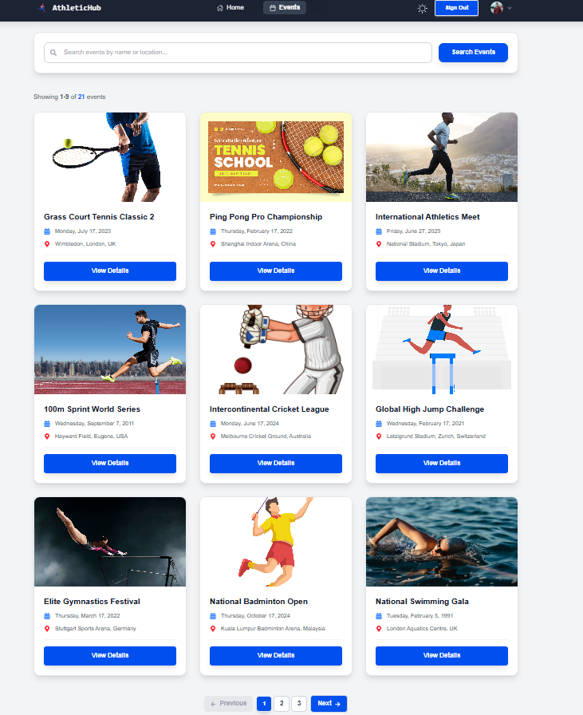

# AuthleticHub —  Sports Website

Live Link : https://athletichub-f25f3.web.app/

---

## About  
**AuthleticHub** is a sports web app built with the **MERN stack** (MongoDB, Express, React, Node) and **Firebase Authentication**. It provides athlete profiles, event listings, registration/bookings, and admin controls.

---

## Features
- 🔐 User authentication with Firebase Auth (email/password, Google sign-in)    
- 📅 Event listing and detailed event pages  
- 📝 Booking/registration system with server-side records  
- ⚙️ RESTful API using Express + Node and MongoDB  
- 🌗 ADD Dark Mode
- 📍 Auto Location Detection
- 📧 Email Booking Confirmation
---
Client side host firebase deploy . server side hosted vercel

# 📸 Project Screenshots

## 🖼 Home

## 🖼 Event page

